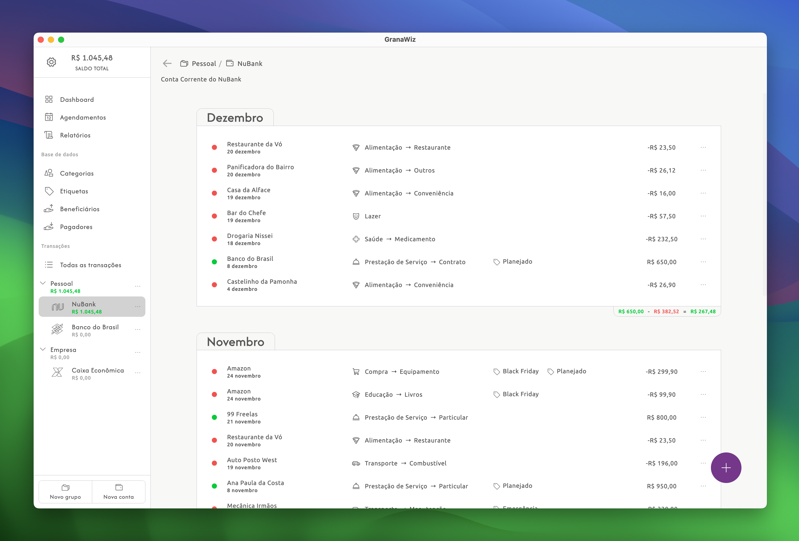

<p align="center">

</p>

---

<p align="center">

</p>

> Software desktop multi-plataforma de gestão de finanças pessoais. Com uma interface limpa, intuitiva e sem publicidade, a aplicação está em fase inicial de desenvolvimentos.

## # Ajustes e melhorias

O projeto ainda está em desenvolvimento e as próximas atualizações serão voltadas para as seguintes tarefas:

- [ ] Importar arquivo .OFX
- [ ] Tela de Relatórios
- [ ] Tela de Agendamentos
- [ ] Tela do Dashboard
- [ ] Preferências do usuário
- [ ] Tradução para inglês

## # Instalando GranaWiz

Atualmente está em versão de prévia (alpha) mas já possível instalar em uma das plataformas suportadas abaixo para acompanhar a evolução do desenvolvimento.

##### ⇢ MacOS:

* Baixe e execute o aquivo: [MacOS (.dmg)](https://drive.google.com/file/d/1lrlyqXRHFgLBOg4kTYZ7rrEZimY74bci/view?usp=sharing)
* Arraste o **GranaWiz** para **Aplicativos**
<br/>

##### ⇢ Windows:

* Baixe e execute o aquivo: [Windows (.msi)](https://drive.google.com/file/d/1ltyk_lJokor-xad6yhxNFLwZDC1lTc4R/view?usp=sharing)
* Se aparecer **"O Windows protegeu o computador"**, *clique em: Mais informações → Executar assim mesmo*
* Se o instalador não criar o atalho no Menu Iniciar, verifique em: ```C:\Program Files\GranaWiz\GranaWiz.exe```
<br/>

---

##### Desenvolvido por [Felipe Gandra](https://felipegandra.com)