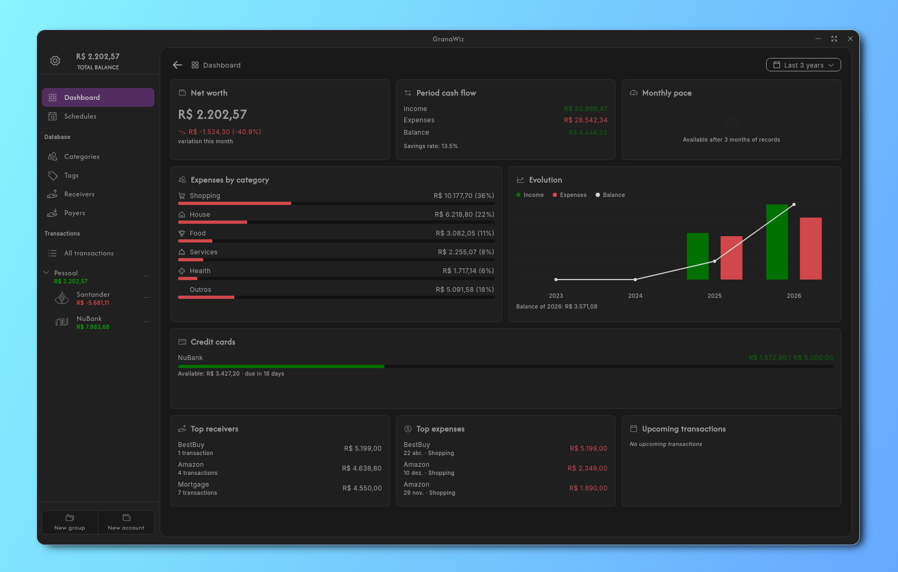

<h1 align="center">GranaWiz</h1>

<p align="center">
  Cross-platform desktop app for personal finance management — local, private, and ad-free.
</p>

<p align="center">
  
  
  
  
</p>

<p align="center">
  
</p>

---

## About

GranaWiz is an **open source** personal finance desktop application. All data is stored locally on your machine — no external servers, no subscription, no tracking.

### Features

- **Dashboard** — net worth delta, spending pace, monthly cash flow, category breakdown, upcoming occurrences, and credit card snapshots
- **Transactions** — advanced filters, recurrence, and installment support
- **Schedules** — future entries with configurable frequency (daily, weekly, monthly, yearly); marking as paid converts the schedule into a real transaction
- **Accounts** — organized in groups (checking, savings, credit card)
- **Categories** and subcategories
- **Tags** for free-form classification
- **Parties** (payers and receivers) with name aliases for statement imports
- **Import** OFX and CSV bank statements with duplicate detection
- **Export** transactions to CSV and schedules to Excel (XLSX)
- UI available in **English and Portuguese**
- Native **macOS** title bar support

---

## Tech Stack

| Layer | Technology |
|---|---|
| Language | Kotlin 2.3 (JVM 25) |
| UI | Jetpack Compose Multiplatform 1.10 |
| Database | SQLite via Hibernate 6 + HikariCP |
| Migrations | Flyway 11 |
| Icons | Phosphor Icons |
| Excel export | Apache POI 5 |
| OFX import | ofx4j 1.39 |
| Testing | JUnit 5 + MockK + H2 |
| Logging | Logback |

---

## Architecture

The project follows **Clean Architecture** across three main layers:

```
app/src/main/kotlin/
├── domain/                  # Entities, repository contracts, and enums
│   ├── entity/              # BankAccount, Transaction, Schedule, Category, Tag, Party…
│   ├── contracts/           # IXxxRepository interfaces
│   └── enums/               # AccountType, TransactionType, ScheduleFrequency…
│
├── application/             # Use cases per domain
│   ├── dashboard/
│   ├── transaction/
│   ├── schedule/
│   ├── category/
│   ├── tag/
│   ├── party/
│   ├── account/
│   ├── group/
│   ├── importStatement/
│   └── userPreference/
│
├── view/                    # Compose UI
│   ├── modules/             # Screens (Dashboard, Transactions, Schedules…)
│   ├── shared/              # Reusable components
│   └── theme/               # Typography and theme
│
└── AppConfig.kt             # DB path: ~/.granawiz/database/granawiz.db
```

---

## Installation

### Pre-built binaries

| Platform      | Download                                                      |
|---------------|---------------------------------------------------------------|
| MacOS         | [Installation for MacOS](https://drive.google.com/file/d/1osgjYAwXLGd67yKmff2TWDWeJg6zlklX/view?usp=sharing)       |
| Windows       | [Installation for Windows](https://drive.google.com/file/d/1nf7TyHFz4Na4Jl1qb1LKFHnl3yITIh5d/view?usp=sharing)     |
| Linux (arm64) | [Installation for Linux (deb)](https://drive.google.com/file/d/1QqkMetpWelPuop4VnVy0B_uDTlGVzD0s/view?usp=sharing) |

> **Windows:** if you see "Windows protected your PC", click *More info → Run anyway*.
> If no shortcut is created, the executable is at `C:\Program Files\GranaWiz\GranaWiz.exe`.

### Build from source

Prerequisites: **JDK 25** and **Gradle** (or use the included wrapper).

```bash
git clone https://github.com/felipegandra/app_granawiz.git
cd app_granawiz/app

# Run in development mode
./gradlew run

# Package a native installer for the current OS
./gradlew packageDmg      # macOS
./gradlew packageMsi      # Windows
./gradlew packageDeb      # Linux
```

The database is created automatically at `~/.granawiz/database/granawiz.db` on first launch.

---

## Running Tests

```bash
cd app
./gradlew test
```

Repository tests use an H2 in-memory database — no external setup required.

---

## Contributing

Contributions are welcome! To propose a fix or a new feature:

1. Fork the repository
2. Create a descriptive branch: `git checkout -b feat/your-feature-name`
3. Commit with a clear message: `git commit -m "feat: describe your change"`
4. Open a Pull Request to branch `develop` explaining the problem and your solution

Please keep the existing code style and add tests for any new behavior.

---

## License

Distributed under the **MIT License**. See [`LICENSE`](LICENSE) for details.

---

Developed by [Felipe Ferreira Gandra](https://felipegandra.com)